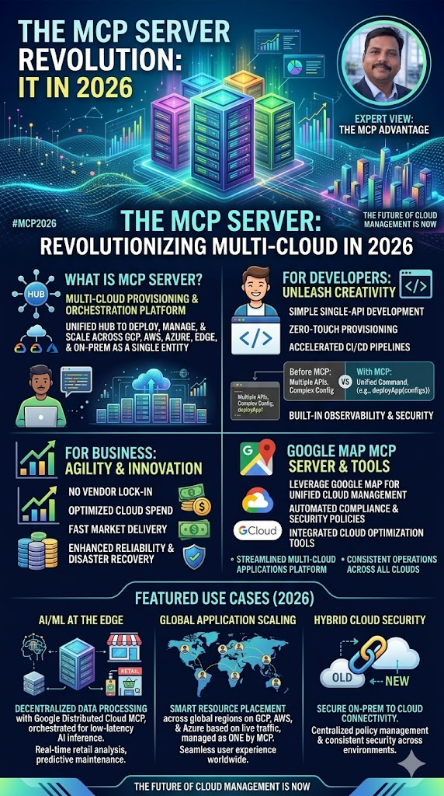

# Google Maps MCP Server with Agentic AI




## Overview
This project demonstrates how to build an AI agent using the Google Agent Development Kit (ADK) that interacts with the Google Maps Model Context Protocol (MCP) server. The project utilizes the `gemini-2.5-flash` model as the underlying Large Language Model (LLM) to answer questions about Google Maps, including providing directions, specifying travel modes, and returning direct Google Maps links.

## Prerequisites
- Python 3
- A valid Google Maps API Key

## Project Structure
```text
GoogleADKMCPserver_maptools/
├── .env                  # Environment variables (e.g., MAPS_API_KEY)
├── requirements.txt      # Python dependencies (python-dotenv, google-adk)
├── README.md             # Project documentation
└── src/
    └── AgenticAIwithGoogleMapMCP.py  # Main script defining the agent and MCP toolset
```

## Setup & Installation

1. **Navigate to the project directory:**
   Ensure you are in the `GoogleADKMCPserver_maptools` root testing directory.

2. **Set up a virtual environment (Recommended):**
   ```bash
   python -m venv .venv
   # On Windows:
   .venv\Scripts\activate
   # On macOS/Linux:
   source .venv/bin/activate
   ```

3. **Install the dependencies:**
   ```bash
   pip install -r requirements.txt
   ```

4. **Configure Environment Variables:**
   Ensure your `.env` file in the root directory contains your Google Maps API Key:
   ```env
   MAPS_API_KEY=your_google_maps_api_key_here
   ```

## Usage
You can run the main script to initialize the agent:
```bash
python src/AgenticAIwithGoogleMapMCP.py
```
*Note: Depending on how you intend to interact with the initialized agent (e.g., via a chat loop or API), you may need to extend the `AgenticAIwithGoogleMapMCP.py` file to include an execution/chat loop to provide prompts directly to `root_agent`.*

## Detailed Code Structure (`src/AgenticAIwithGoogleMapMCP.py`)
- **Environment Loading**: `load_dotenv()` initializes the environment variables and loads `MAPS_API_KEY` from the `.env` file.
- **MCP Toolset Initialization (`maps_toolset`)**: Uses `McpToolset` and `StreamableHTTPConnectionParams` to establish a connection to the Google-hosted Maps MCP endpoint (`https://mapstools.googleapis.com/mcp`). It securely passes the API key via the `X-Goog-Api-Key` HTTP header.
- **Agent Creation (`root_agent`)**: Initializes an `LlmAgent` named `maps_mcp_agent` using the `gemini-2.5-flash` model. The agent is explicitly instructed to act as a helpful assistant that leverages the attached maps tools to answer questions and provide directions with proper travel modes and Google Maps links.
